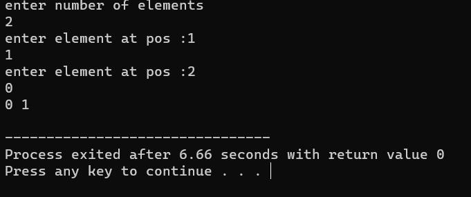

# [Sorting](sort.cpp)

This C++ program demonstrates the Bubble Sort algorithm. It takes user input to create an array of integers and sorts the array in ascending order using Bubble Sort. The program is a command-line application, making it easy to use for sorting simple lists of numbers.

## Usage
Run the program.
Enter the number of elements and the elements themselves.
The program will sort the array and display the sorted result.
Bubble Sort is a basic sorting algorithm that repeatedly compares and swaps adjacent elements until the list is sorted. This program serves as a simple educational example of Bubble Sort in action.

## Algorithm 
     Start the program.

     Declare an integer variable n to store the number of elements to be sorted.

     Output a message asking the user to enter the number of elements.

     Read the value of n from the user.

     Declare an integer array numbers with a size of n to store the elements to be sorted.

     Using a for loop, iterate from i = 0 to n - 1 to input the elements into the numbers array. Output a message asking the user to enter an element at position i+1 and store the value in numbers[i].

     Perform the Bubble Sort algorithm to sort the elements in the numbers array. Use two nested for loops:
        a. Outer loop (i) runs from 0 to n - 1.
        b. Inner loop (j) runs from 0 to n - i - 1.
        c. Within the inner loop, compare numbers[j] with numbers[j + 1]. If numbers[j] is greater than numbers[j + 1], swap the elements using the swap function.

     After sorting, the numbers array will be in ascending order.

     Use a for loop to iterate from i = 0 to n - 1 and output the sorted elements, separated by spaces.
  
     Output a newline character to format the output.

     End the program by returning 0.

  

 
